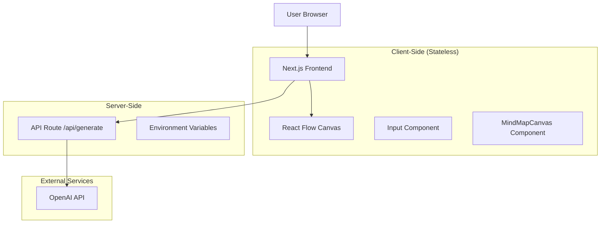

# Design Document

## Overview

Concept Compass MVP is a stateless, AI-powered mind mapping application built with Next.js 15, React 19, and React Flow. The application transforms user-entered concepts into interactive, explorable graphs using OpenAI's GPT models. The design emphasizes simplicity, performance, and a seamless user experience while maintaining a completely stateless architecture.

The core user flow involves: entering a concept → generating an AI-powered mind map → clicking nodes to re-center and expand the graph infinitely. All interactions are client-side with secure API calls to OpenAI through a Next.js API route.

## Architecture

### High-Level Architecture



### Technology Stack Integration

-   **Frontend Framework**: Next.js 15.5.2 with App Router and Turbopack
-   **UI Library**: React 19.1.0 with TypeScript
-   **Styling**: Tailwind CSS v4 with shadcn/ui (New York style)
-   **Mind Map Visualization**: React Flow (to be installed)
-   **AI Integration**: OpenAI API via secure server-side route
-   **Fonts**: Geist Sans & Geist Mono (already configured)
-   **Icons**: Lucide React (already available)

### File Structure

```
src/
├── app/
│   ├── layout.tsx                 # Root layout (existing)
│   ├── page.tsx                   # Main page with input (to be modified)
│   ├── globals.css                # Global styles (existing)
│   └── api/
│       └── generate/
│           └── route.ts           # OpenAI API route (to be created)
├── components/
│   ├── ui/                        # shadcn/ui components (existing)
│   └── mind-map/
│       └── mind-map-canvas.tsx    # React Flow component (to be created)
└── lib/
    └── utils.ts                   # Utilities (existing)
.env.example                       # Example environment variables (to be created)

```

## Components and Interfaces

### 1. Main Page Component (`src/app/page.tsx`)

**Purpose**: Entry point with concept input and mind map display

**State Management**:

```typescript
interface PageState {
    currentConcept: string;
    inputValue: string;
    mindMapData: MindMapData | null;
    isLoading: boolean;
    error: string | null;
}
```

**Key Features**:

-   Single text input with submit button
-   Conditional rendering: input form OR mind map canvas
-   Loading states and error handling
-   Responsive design with Tailwind CSS

### 2. MindMapCanvas Component (`src/components/mind-map/mind-map-canvas.tsx`)

**Purpose**: React Flow-based interactive mind map visualization

**Props Interface**:

```typescript
interface MindMapCanvasProps {
    concept: string;
    onNodeClick: (concept: string) => void;
    isLoading?: boolean;
}
```

**Internal State**:

```typescript
interface MindMapState {
    nodes: Node[];
    edges: Edge[];
    isInitialized: boolean;
}
```

**Key Features**:

-   React Flow integration with custom node types
-   Central node (current concept) + 5-8 related nodes
-   Click handlers for node interaction
-   Zoom, pan, and selection controls
-   Loading overlay during API calls

### 3. API Route (`src/app/api/generate/route.ts`)

**Purpose**: Secure OpenAI API integration

**Request Interface**:

```typescript
interface GenerateRequest {
    concept: string;
}
```

**Response Interface**:

```typescript
interface GenerateResponse {
    success: boolean;
    concepts?: string[];
    error?: string;
}
```

**Key Features**:

-   POST endpoint with JSON body validation
-   OpenAI API integration using environment variables
-   Error handling and appropriate HTTP status codes
-   Security: API key never exposed to client

## Data Models

### Mind Map Data Structure

```typescript
interface MindMapData {
    centralConcept: string;
    relatedConcepts: string[];
    timestamp: number; // For debugging, not persistence
}

interface Node {
    id: string;
    type: "central" | "related";
    data: {
        label: string;
        concept: string;
    };
    position: { x: number; y: number };
    style?: React.CSSProperties;
}

interface Edge {
    id: string;
    source: string;
    target: string;
    type: "default";
    style?: React.CSSProperties;
}
```

### API Communication

```typescript
// Client to API
interface APIRequest {
    method: "POST";
    headers: { "Content-Type": "application/json" };
    body: string; // JSON.stringify({ concept: string })
}

// API Response
interface APIResponse {
    status: 200 | 400 | 500;
    body: GenerateResponse;
}
```

## Error Handling

### Client-Side Error Handling

1. **Input Validation**: Empty concept prevention with user feedback
2. **Network Errors**: Retry mechanism with user-friendly messages
3. **API Errors**: Display specific error messages from server
4. **Loading States**: Visual feedback during API calls

### Server-Side Error Handling

1. **Request Validation**: 400 errors for missing/invalid concepts
2. **OpenAI API Failures**: 500 errors with generic messages (no API details exposed)
3. **Environment Issues**: Proper error logging and fallback responses
4. **Rate Limiting**: Graceful handling of OpenAI rate limits

### Error UI Components

```typescript
interface ErrorDisplayProps {
    error: string;
    onRetry?: () => void;
    onReset?: () => void;
}
```

## Testing Strategy

### Unit Testing Focus Areas

1. **API Route Testing**:

    - Valid concept processing
    - Error handling for invalid inputs
    - OpenAI API integration mocking
    - Environment variable validation

2. **Component Testing**:

    - MindMapCanvas rendering with mock data
    - Node click event handling
    - Loading state display
    - Error state rendering

3. **Integration Testing**:
    - End-to-end concept submission flow
    - API call and response handling
    - State management across components

### Testing Tools

-   **Vitest**: Unit and component testing framework
-   **@testing-library/react**: Component testing utilities
-   **jsdom**: DOM environment for testing
-   **@vitest/ui**: Interactive UI for Vitest
-   **MSW (Mock Service Worker)**: API mocking
-   **Playwright**: E2E testing (optional for MVP)

### Test Data

```typescript
const mockMindMapData: MindMapData = {
    centralConcept: "Sustainable Urban Farming",
    relatedConcepts: [
        "Vertical Farming",
        "Community Gardens",
        "Aquaponics",
        "Rooftop Agriculture",
        "Hydroponic Systems",
    ],
    timestamp: Date.now(),
};
```

## Performance Considerations

### Client-Side Optimization

1. **React Flow Performance**:

    - Lazy loading of React Flow components
    - Optimized node rendering with React.memo
    - Efficient edge calculations

2. **State Management**:

    - Minimal re-renders with proper dependency arrays
    - Debounced input handling
    - Efficient error state clearing

3. **Bundle Size**:
    - Tree-shaking for unused React Flow features
    - Dynamic imports for heavy components

### Server-Side Optimization

1. **API Route Efficiency**:

    - Streamlined OpenAI API calls
    - Proper error handling without retries (for MVP)
    - Minimal response payload

2. **Caching Strategy**:
    - No server-side caching (stateless MVP)
    - Client-side could cache recent results (future enhancement)

## Security Implementation

### API Key Protection

1. **Environment Variables**: OPENAI_API_KEY stored securely
2. **Server-Only Access**: API key never sent to client
3. **Request Validation**: Sanitize and validate all inputs
4. **Error Message Sanitization**: No internal details in client errors

### Input Sanitization

```typescript
function sanitizeConcept(concept: string): string {
    return concept
        .trim()
        .slice(0, 100) // Limit length
        .replace(/[<>]/g, ""); // Basic XSS prevention
}
```

## Styling and UI Design

### Design System

-   **Color Scheme**: Tailwind's zinc base color with CSS variables
-   **Typography**: Geist Sans for UI, Geist Mono for code elements
-   **Component Library**: shadcn/ui New York style components
-   **Responsive Design**: Mobile-first approach with Tailwind breakpoints

### Mind Map Styling

```typescript
const nodeStyles = {
    central: {
        background: "hsl(var(--primary))",
        color: "hsl(var(--primary-foreground))",
        border: "2px solid hsl(var(--border))",
        borderRadius: "8px",
        padding: "12px 16px",
        fontSize: "16px",
        fontWeight: "600",
    },
    related: {
        background: "hsl(var(--card))",
        color: "hsl(var(--card-foreground))",
        border: "1px solid hsl(var(--border))",
        borderRadius: "6px",
        padding: "8px 12px",
        fontSize: "14px",
    },
};
```

### Responsive Behavior

-   **Desktop**: Full canvas with sidebar input
-   **Tablet**: Stacked layout with collapsible input
-   **Mobile**: Full-screen canvas with overlay input

## Integration Points

### OpenAI API Integration

**API Provider**: OpenRouter.ai (This is the endpoint we will call)

**Model Selection**:

-   **Development/Low Latency**: `gpt-oss-20b`
-   **Production/High Reasoning**: `gpt-oss-120b` (Primary target for the hackathon)

**Prompt Engineering**:

```typescript
const generatePrompt = (concept: string) => `
Generate a list of 5 to 7 diverse concepts related to "${concept}".
Return ONLY a valid JSON array of strings in your response, with no other text, explanations, or markdown.

For the concept list, provide a mix of the following categories:
- A core component or principle.
- A practical application or use case.
- A potential challenge or consideration.
- A related technology or tool.
- A surprising or "out-of-the-box" connection.

Example for "Sustainable Urban Farming":
["Vertical Farming", "Community Supported Agriculture (CSA)", "Water Scarcity", "IoT Soil Sensors", "Mycoremediation"]
`;
```

### React Flow Integration

**Installation Required**:

```bash
pnpm add reactflow
```

**Basic Setup**:

```typescript
import ReactFlow, {
    Node,
    Edge,
    Controls,
    Background,
    useNodesState,
    useEdgesState,
} from "reactflow";
import "reactflow/dist/style.css";
```

## Deployment Considerations

### Environment Setup

-   A `.env.example` file will be created to document required variables.
-   Create a `.env.local` file by copying `.env.example` for local development.

```bash
# .env.example
OPENAI_API_KEY=""
```

```bash
# .env.local
OPENAI_API_KEY=sk-...
```

### Build Configuration

-   **Turbopack**: Already configured for dev and build
-   **Static Generation**: Pages can be statically generated
-   **API Routes**: Serverless functions for /api/generate

### Performance Monitoring

-   **Core Web Vitals**: Monitor LCP, FID, CLS
-   **API Response Times**: Track OpenAI API latency
-   **Error Rates**: Monitor client and server errors
